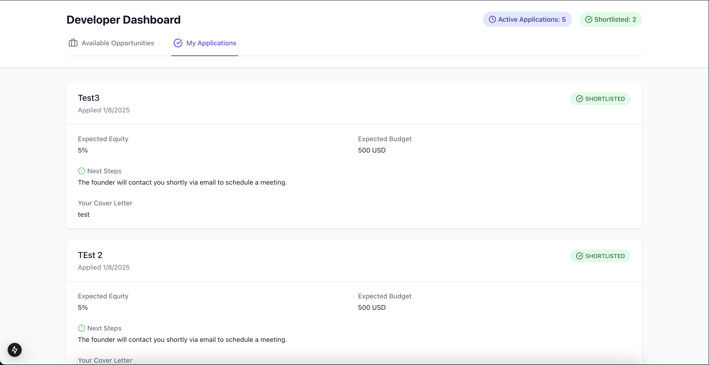
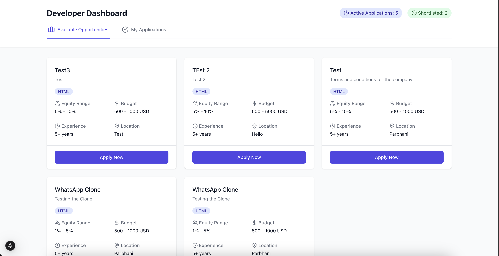
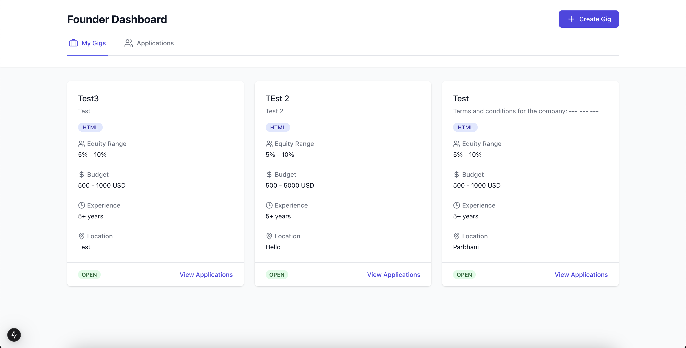
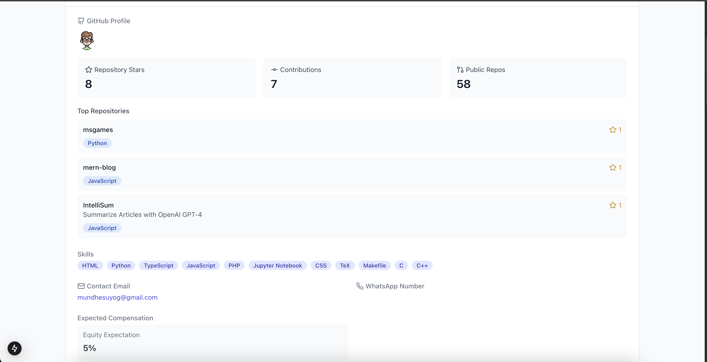

# CoFounder Platform

CoFounder is a platform that connects visionary founders with skilled technical co-founders to transform innovative ideas into reality.

## Features

- **Founder Dashboard**: Founders can create gigs, manage applications, and connect with potential co-founders.
- **Developer Dashboard**: Developers can browse available gigs, apply for them, and showcase their skills and experience.
- **Secure Authentication**: Both founders and developers can securely sign up and sign in to the platform.
- **Application Management**: Founders can review, shortlist, and reject applications from developers.
- **Notification System**: Developers receive notifications on the status of their applications.

## Screenshots

Here are some screenshots of the CoFounder platform:

## Getting Started

To get started with the CoFounder platform, please follow these steps:

1. **Sign Up**: Visit the CoFounder website and sign up as either a founder or a developer.
2. **Create/Apply for Gigs**: Founders can create new gigs, while developers can browse and apply for available opportunities.
3. **Manage Applications**: Founders can review, shortlist, and reject applications from developers.
4. **Collaborate**: Once a developer is shortlisted, the founder and developer can begin collaborating on the project.